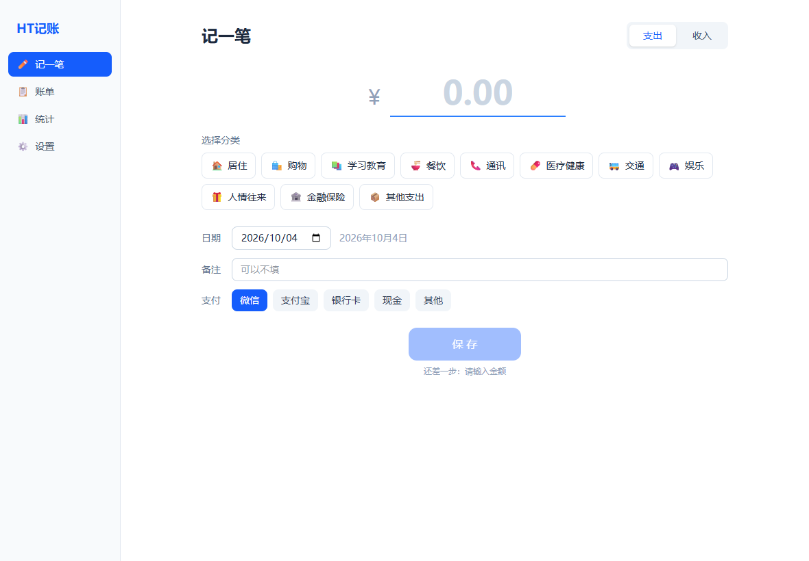
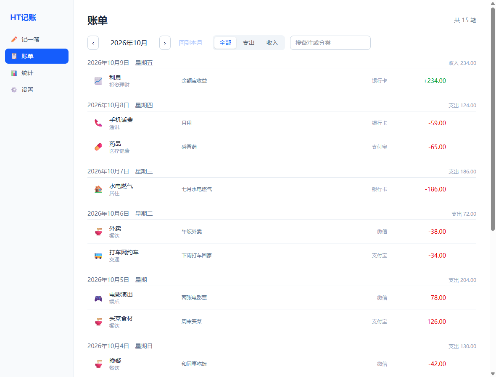
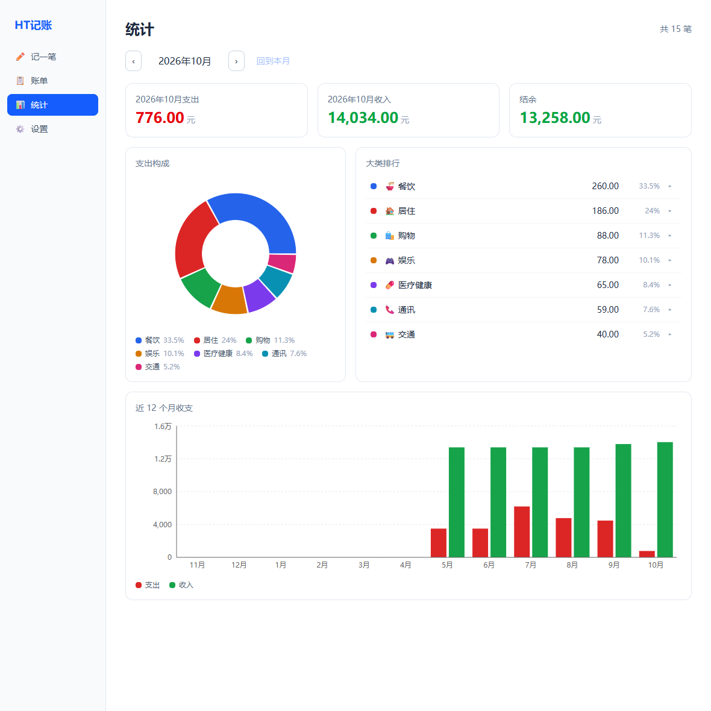
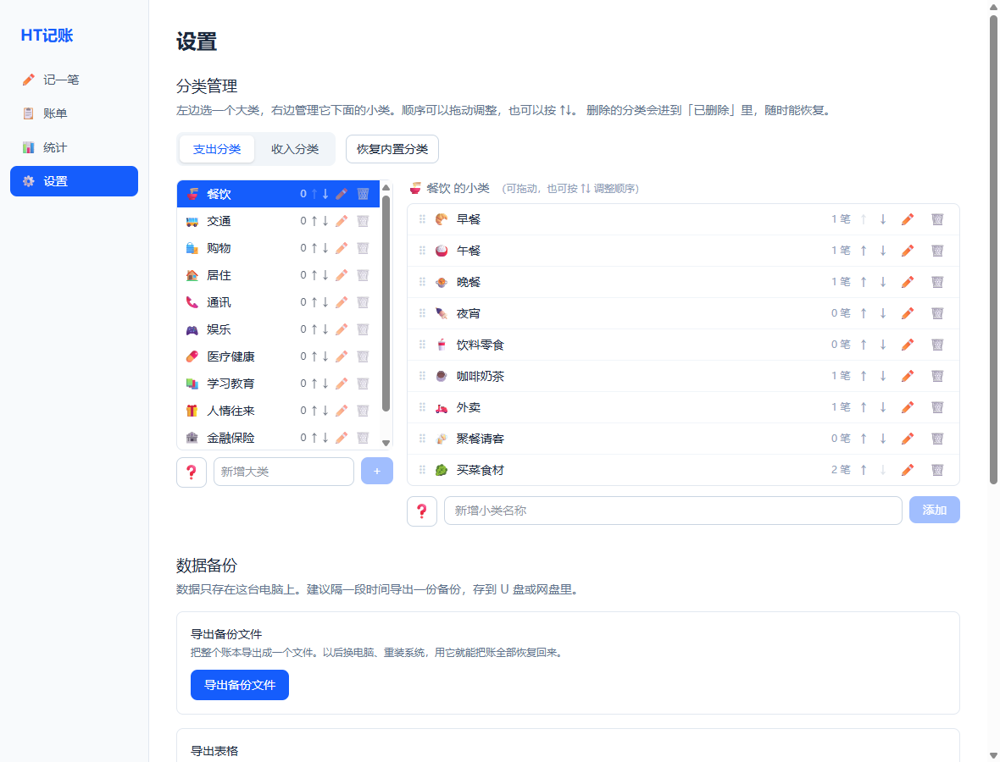

# HT记账

一个**完全本地、不联网**的个人记账软件。数据只存在你自己的电脑上，不需要注册账号，也不会把任何东西传到网上。

界面用起来是这样：



> 截图里的账单是**演示数据**，不是任何人的真实账本。

---

## 下载安装

到 [Releases](../../releases) 页面下载最新版的 `HTJizhang-x.x.x-setup.exe`，双击安装。

| 系统 | 状态 |
|---|---|
| Windows 10 / 11（64 位） | ✅ 可下载 |
| macOS | ⏳ 还没做，见下方「还没做的事」 |

⚠️ **第一次打开时，Windows 可能会提示「Windows 已保护你的电脑」。** 这是**正常现象**，不是病毒。

**也可能什么都不弹、直接开始安装。** 弹不弹取决于你这台电脑的设置和安装包的下载来源 ——
**两种都正常**，不代表软件有问题，也不代表你下错了东西。原因见下方「为什么会有安全提示」。

如果弹了，处理办法（三步）：

1. 点提示框里的 **「更多信息」**
2. 点右下角出现的 **「仍要运行」**
3. 之后正常安装即可

更详细的图文说明写在 [docs/首次安装说明.md](docs/首次安装说明.md)。

---

## 为什么会有安全提示

Windows 和 macOS 会对**没有数字签名**的程序弹警告。

数字签名是一份「这个软件是谁做的、有没有被篡改」的证明，需要通过**实名认证**向证书机构购买，个人开发者一年要几百到上千元。这是一个免费开源的小工具，不值得为此花钱，所以没有买。

**这意味着：**
- 那个提示不会影响软件的任何功能，只是系统在说「我不认识这个作者」。
- 你应该**只从这个仓库的 Releases 页面下载**。别人转发给你的安装包我无法保证。

---

## 它能做什么

| 页面 | 做什么 |
|---|---|
| **记一笔** | 键盘直接输金额，回车就存好。两级分类，最近用过的自动排在最前面 |
| **账单** | 按月看账、按天分组、每天一小计；可按收支筛选、搜备注或分类名；点一行就能改或删 |
| **统计** | 本月支出 / 收入 / 结余三张卡片；支出构成饼图；近 12 个月收支柱状图；大类排行，点开可下钻到小类 |
| **设置** | 分类自己增删改（内置 96 条，可自由调整）；导出备份、导出 Excel 能打开的表格、从备份恢复 |





几个可能值得一提的设计：

- **金额按「分」存整数**，不是小数。小数在反复累加后会产生分位偏差，记账软件不能有这个毛病。
- **删除分类不会删掉历史账单。** 已经被账单用过的分类会被「归档」：不再出现在记账选择器里，但历史账单和统计**一分钱都不会少**。
- **统计页和账单页的月份各管各的。** 在账单页翻到 3 月查账，切到统计页不会被强行带过去。
- **页面上所有的百分比都以「本月支出总额」为分母**，饼图、排行、下钻都一样。

---

## 你的数据在哪里

| 系统 | 位置 |
|---|---|
| Windows | `%APPDATA%\HTJizhang\`（在文件管理器地址栏粘贴这串就能打开） |
| macOS | `~/Library/Application Support/HTJizhang/` |

记账数据是里面的 `ht-jizhang.db` 一个文件。设置页里也有「打开数据文件夹」按钮。

**卸载软件不会删除这个文件夹**，你的账本不会因为卸载而消失。

> 建议隔一段时间在设置页点一次「导出备份文件」，存到 U 盘或网盘里。
> 备份是把整个账本导出成一个文件，换电脑、重装系统后用它就能把账全部恢复回来。

### 关于「不联网」

这不是一句宣传语，是可以核对的事实：源码里没有任何发起网络请求的代码（没有 `fetch`、没有 `XMLHttpRequest`、没有 `http` / `https` / `net` 模块），打包产物里也一样。除了你主动点击的「打开数据文件夹」这类本机操作，软件不与外界通信。

---

## 还没做的事

诚实列一下，免得下载之后发现和预期不符：

- **macOS 版还没出。** 生成 `.dmg` 需要一台苹果电脑，目前还没做这一步。
- **没有代码签名**，所以会有上面说的那个安全提示。
- **没有自动更新。** 装好之后不会自己升级，想要新版本要手动来 Releases 下载。
- **没有云同步、没有多设备。** 这是单机软件，数据只在这台电脑上 —— 这既是它的缺点，也是它不联网、不必注册账号的原因。
- **没有回收站。** 删除一笔账就是真的删掉了，删之前会弹框确认。

---

## 给想看代码的人

技术栈：Electron 44 + React 19 + TypeScript，数据库用 Electron 内置的 `node:sqlite`（所以不需要编译任何原生模块）。

```bash
npm install
npm run dev          # 开发预览，改代码自动刷新
npm test             # 自动化测试
npm run typecheck    # 类型检查
npm run build:win    # 打包 Windows 安装包，产物在 release/
```

当前的自动化测试是 **429 项全绿**。除了单元测试，`scripts/verify/` 下还有七个**界面客观验证脚本** —— 它们真的启动打包好的程序，通过 Electron 调试接口去点按钮、读计算样式，验证「界面到底做对了没有」。这些脚本自己也做过反向辨识（故意改坏代码，确认对应的检查项确实会变红），跑法见 [scripts/verify/README.md](scripts/verify/README.md)。

> 源码注释里常会看到「见 CLAUDE.md §5.x」「CLAUDE.md §九」这样的引用。
> `CLAUDE.md` 是这个项目的**内部开发规程**（编码约定、踩过的坑、每条规矩为什么这么定），
> 它**不随本仓库发布**，所以那些引用在这里点不开 —— 不是链接坏了，是那份文件本来就不在。
> 规程的**结论**都落在代码和 `scripts/verify/` 的检查里，读代码不受影响。

**这个项目的代码 100% 由 AI（Claude Code）编写**，项目所有者负责提需求和做技术决策。

---

## 许可证

[MIT](LICENSE)。可以自由使用、修改、分发。
